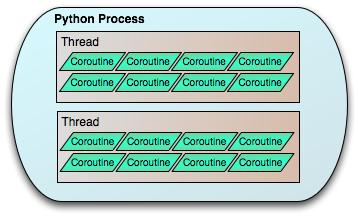

# 线程模型

## 绿色线程

Openstack中的服务均使用绿色线程（green thread）来实现多任务的并发。使用Python的eventlet[^1]和greenlet[^2]库来实现。绿色线程也被叫做协程(Coroutine), 因为他是用户态级别的线程（由用户态的程序来实现该线程的调度），而本地线程是内核级别的线程（由操作系统内核调度）。因此绿色线程其实是在一个本地线程内部的线程，一个本地线程中可以有多个绿色线程，组成一个绿色线程池，绿色线程池中的绿色线程是并不是真正的并发执行的，是顺序分享本地线程中的时间片的。当一个绿色线程执行完成或者主动切换出来，其他的绿色线程才能执行。所以只要一个绿色线程阻塞，绿色线程池中的其他绿色线程均会堵塞无法执行。[线程模型](http://eventlet.net/doc/threading.html)如下。



从以上图可以看出，所有的绿色线程都会限制在一个Python的本地线程中。看起来好像是每个本地线程是一个包含绿色线程的小世界，一个本地线程中的绿色线程之间可以相互无缝切换，但是不同本地线程的绿色线程之间无法相互切换。如果想要线程之间能够切换，只能只用本地线程或者管道实现。但是幸运的是如果已经使用了绿色线程就很少使用本地线程的并发性，因为绿色线程可以实现这种功能，虽然不是真正意义上的并发。

### 特性

1. 由于绿色线程在原理上是顺序执行的，因此消除了资源竞争的可能性，但是并不能完全消除，因此在某些场景下需要使用__@lockutils.synchronized(...) __来防止资源竞争。
2. 由于所有的绿色线程在一个Python本地线程中，所以当其中某个绿色线程由于某种长时间操作而堵塞时，其他的绿色线程也会堵塞无法正常工作。
3. 如果一个绿色线程的执行代码时间过长，但是代码中没有触发上下文切换的代码，则可以使用`greenthread.sleep(0)`显式将执行权从当前的绿色线程切换出去，去执行正在pending的其他绿色线程。sleep(0)是为了保证当前只有一个绿色线程时，不会导致执行的延迟。
4. 使用绿色线程，一个本地线程就能实现多任务的并发，大大降低了系统的开销。且绿色线程之间的切换速度远比本地进程之间的切换效率高。

### 如何使用

#### Nova中使用

从以上可以看到，实际上一个服务只运行一个本地线程，然后在一个本地线程中使用绿色线程来实现并发。在nova的服务启动时，会使用`eventlet.monkey_patch`方法来绿化除**OS**模块以外的可以绿化的Python模块。代码如下。

```Python
import eventlet

from nova import debugger

if debugger.enabled():
    # turn off thread patching to enable the remote debugger
    eventlet.monkey_patch(os=False, thread=False)
else:
    eventlet.monkey_patch(os=False)
```


在不开启*debug*模式下，*evnetlet* 会绿化**threading**模块。因此如果在代码中使用**threading** 模块，实际上只是创建一个绿色线程而已，如下所示。

```python
from threading import Thread
......


def period_heartbeat_file(heartbeat_file):
    """This function will be always running until nova service is terminated.

    It displays nova service alive and working well. Here we don't use
    @periodic_task.periodic_task decorator because the decorator start after
    manager._init_host(), init_host will cost much time we can't expect when
    instances are too many.

    :return: None
    """
    heartbeat_interval = CONF.heartbeat_interval

    def heartbeat_process():
        while True:
            # create a file in specific directory
            file_path = CONF.heartbeat_file_path + "/%s" % heartbeat_file
            try:
                if not os.path.exists(CONF.heartbeat_file_path):
                    execute('mkdir', '-p', "%s" % CONF.heartbeat_file_path,
                            run_as_root=True, attempts=1)
                if not os.path.isfile(file_path):
                    execute("touch", file_path, run_as_root=True, attempts=2)
                time.sleep(heartbeat_interval)
            except Exception as ex:
                # catch all the exception avoiding threading exits
                LOG.error(_LE("Write to file failed %s"), ex)
                time.sleep(heartbeat_interval)

    heartbeat_thread = Thread(target=heartbeat_process)
    heartbeat_thread.setDaemon(True)
    heartbeat_thread.start()
    LOG.info(_LI("Start thread for heartbeat file successfully"))
```

如果想使用真正的线程，请参考下节[本地线程](#本地线程)。

#### 数据库使用

目前我们访问数据库使用oslo.db ，oslo.db有多个API drirver，有[PyMySQL](https://wiki.openstack.org/wiki/PyMySQL_evaluation) ，MySQL-python 等。其中**PyMySQL**是oslo.db的默认API driver，使用eventlet实现并发没有问题。但是**MySQL-python **使用一个外部的C代码库来访问数据库，这就有导致主线程堵塞的情况。

所有尽量使用PyMySQL库来实现数据库的访问。

## 本地线程

本地线程（native thread）在某些场景下也会使用。官方说明在如下场景下需要使用本地线程。

> The vast majority of the times you’ll want to use threads are to wrap some operation that is not “green”, such as a C library that uses its own OS calls to do socket operations. The [`tpool`](http://eventlet.net/doc/threading.html#module-eventlet.tpool) module is provided to make these uses simpler. 

在直接调用操作系统的C代码库接口做一些系统调用如socket的操作，或者IO操作时候，建议用本地线程，因为这些操作都是堵塞性的。如果使用绿色线程可能会导致绿色线程池中的其他线程也无法执行。

因此线程是内核级的线程，由操作系统内核来调度，可以分享使用多个CPU，而绿色线程只能使用一个CPU。

### 如何使用

由于nova服务启动的时候已经调用`eventlet.monkey_patch`将包括`threading` 的其他模块进行了打补丁绿化。因此如果在服务中使用本地线程，需要调用`eventlet`的`patcher.original`函数来获取没有绿化的`threading`模块。

### Nova中的使用

在libvirt的driver中处理从libvirt发送的**事件**时，是通过本地线程的方式处理的。因为需要有socket的操作。

如下代码所示。

```Python
from eventlet import patcher
......

native_socket = patcher.original('socket')
native_threading = patcher.original("threading")
native_Queue = patcher.original("Queue" if six.PY2 else "queue")

```

[^1]: http://eventlet.net/doc/
[^2]: http://greenlet.readthedocs.io/en/latest/